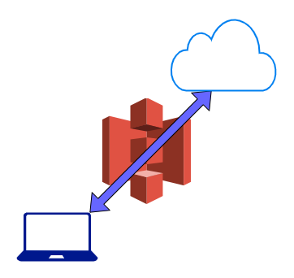

# Self-Hosted Serverless Cloud Storage

Host your own cloud storage at solely S3 rates, i.e., 50 TB /month at 1.6 INR/GB (~0.021 USD) per month.

<div align="center">
  
</div> 

## Features
* Completely serverless (that's right, no Lambda either)
* Security: Firebase authenticated client, data access restricted by 
  [AWS S3 IAM Policies](https://aws.amazon.com/blogs/security/writing-iam-policies-how-to-grant-access-to-an-amazon-s3-bucket/).
* View, Download, Organize a plethora of diverse files: from videos and images, to ipynbs and PDFs!

## How to Set Up

* [Create an AWS S3 bucket](https://docs.aws.amazon.com/AmazonS3/latest/userguide/create-bucket-overview.html).
* [Create your AWS credentials](https://docs.aws.amazon.com/general/latest/gr/aws-sec-cred-types.html#access-keys-and-secret-access-keys). (**Make sure you write secure IAM policies in accordance with [AWS S3 IAM Policies](https://aws.amazon.com/blogs/security/writing-iam-policies-how-to-grant-access-to-an-amazon-s3-bucket/).**)  
* In the project directory, run: `cat "REACT_APP_S3_BUCKET=<YOUR_BUCKET_NAME> 
  REACT_APP_S3_ACCESS_KEY=<YOUR_ACCESS_KEY_ID> 
  REACT_APP_S3_SECRET_ACCESS_KEY=<YOUR_AWS_SECRET_ACCESS_KEY> 
  REACT_APP_S3_REGION=<YOUR_AWS_DEFAULT_REGION>
  " >> .env`
* [Create and Register a Firebase project](https://firebase.google.com/docs/web/setup#create-firebase-project).
* [Create a Firebase config object](https://firebase.google.com/docs/web/setup#config-object).
* Create an allowed user for your config (`https://console.firebase.google.com/project/<project-name>/authentication/users`).
* From the config object, note the `API_KEY`, `PROJECT_ID`, `SENDER_ID`, `APP_ID`, and `MEASUREMENT_ID`.
* In the project directory, run: `cat "REACT_APP_FIREBASE_API_KEY=<YOUR_API_KEY> 
  REACT_APP_FIREBASE_PROJECT_ID=<YOUR_PROJECT_ID>
  REACT_APP_FIREBASE_SENDER_ID=<YOUR_SENDER_ID>
  REACT_APP_FIREBASE_APP_ID=<YOUR_APP_ID>
  REACT_APP_FIREBASE_MEASUREMENT_ID=<YOUR_MEASUREMENT_ID>
  " >> .env`
* `npm install`
* `npm start`

<h3>Recommended IAM Policy:</h3>
<h5 style="color: red">Only allow public access to buckets and objects granted through new access control lists (ACLs)</h5>

```json
{
    "Version": "2012-10-17",
    "Id": "http referer policy example",
    "Statement": [
        {
            "Sid": "Allow all kind of http requests originating from https://<YOUR_WEBSITE>",
            "Effect": "Allow",
            "Principal": "*",
            "Action": "s3:*",
            "Resource": [
                "arn:aws:s3:::<BUCKET_NAME>/*",
                "arn:aws:s3:::<BUCKET_NAME>"
            ],
            "Condition": {
                "StringLike": {
                    "aws:Referer": [
                        "https://<YOUR_WEBSITE>"
                    ]
                }
            }
        }
    ]
}
```
